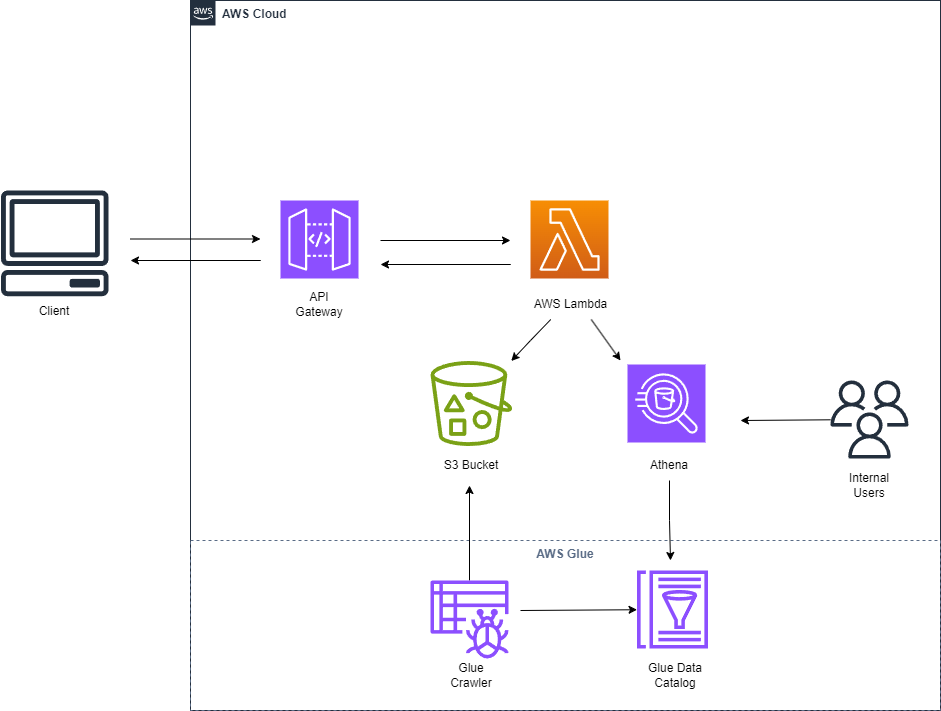

# Clean Energy City Analyzer

## Overview

- **Frontend:** TypeScript, React, Vite
- **Backend:** AWS Lambda, API Gateway, and S3
- **Infrastructure as Code:** Terraform
- **CI/CD:** GitHub Actions

## Table of Contents
1. [Overview](#overview)
2. [Deployment Instructions](#deployment-instructions)
3. [Architecture Diagram](#architecture-diagram)

---

## Deployment Instructions

### Prerequisites
- AWS CLI configured with necessary permissions
- Terraform
- Docker
- Node.js
- Python

### Steps to Deploy
1. **Clone the Repository:**
   ```sh
   git clone https://github.com/duyent1999/clean-energy-analyzer.git
   cd clean-energy/terraform
   ```
2. **Initialize and Apply Terraform:**
   ```sh
   terraform init
   terraform apply -auto-approve
   ```
   This will provision:
   - An AWS Lambda function
   - API Gateway to expose the Lambda as a REST API
   - An S3 bucket
   - Necessary IAM roles and policies

3. **Build and Deploy Frontend:**
   ```sh
   cd frontend/my-app
   docker build -t frontend-app .
   docker run -d -p 8080:80 frontend-app
   ```

4. **Testing the Deployment:**

- Access the frontend at [http://localhost:8080](http://localhost:8080/)
- Use the UI to send requests to the API Gateway and validate responses

---
## Architecture Diagram


